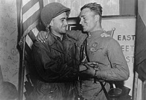

Header 4

**Evaluation Only. Created with Aspose.Words. Copyright 2003-2023 Aspose Pty Ltd.**
## **Kết quả**
Hậu quả trực tiếp của chiến tranh này là sự chiến thắng của phía Đồng Minh. Mỗi nước trong phe Trục đều phải đầu hàng vô điều kiện. Đức bị các lực lượng từ Mỹ, Anh, Liên Xô và Pháp chiếm đóng, trong khi Áo bị chia cắt từ Đức và cũng bị chiếm đóng một cách tương tự. Nhật bị quân Mỹ chiếm đóng trong khi Liên Xô chiếm đóng các nước Đông Âu.[[<i>cần dẫn nguồn</i>]]

.jpg)Quân [Mỹ](https://vi.wikipedia.org/wiki/Hoa_K%E1%BB%B3 "Hoa Kỳ") và [Liên Xô](https://vi.wikipedia.org/wiki/Li%C3%AAn_X%C3%B4 "Liên Xô") gặp nhau tại [rgau](https://vi.wikipedia.org/wiki/rgau "rgau") bên bờ [sông Elbe](https://vi.wikipedia.org/wiki/Elbe "Elbe")

Trái với [Chiến tranh thế giới thứ nhất](https://vi.wikipedia.org/wiki/Chi%E1%BA%BFn_tranh_th%E1%BA%BF_gi%E1%BB%9Bi_th%E1%BB%A9_nh%E1%BA%A5t "Chiến tranh thế giới thứ nhất"), khi các giới hạn làm suy yếu các nước và các nước thua cuộc bị ngăn chặn việc tái hội nhập cộng đồng quốc tế, các nước thua cuộc đã được cung cấp viện trợ để phục hồi và hội nhập cộng đồng thế giới như các quốc gia hoà bình khác. Vì lẽ đó, Đức và Nhật đã trở thành hai nước quan trọng và có nhiều ảnh hưởng mà không cần phải khiêu chiến.[[<i>cần dẫn nguồn</i>]]

Sự thất bại của [Hội Quốc Liên](https://vi.wikipedia.org/wiki/H%E1%BB%99i_Qu%E1%BB%91c_Li%C3%AAn "Hội Quốc Liên") trong việc ngăn chặn chiến tranh đã dẫn đến việc thành lập [Liên Hiệp Quốc](https://vi.wikipedia.org/wiki/Li%C3%AAn_Hi%E1%BB%87p_Qu%E1%BB%91c "Liên Hiệp Quốc"), một tổ chức quốc tế mới và có nhiều sửa đổi, cho đến nay vẫn là tổ chức quan trọng nhất trong việc thúc đẩy hoà bình và hợp tác.[[<i>cần dẫn nguồn</i>]]
### Số người chết
Thống kê năm 1965 của Liên Hợp Quốc cho biết chỉ riêng số người thiệt mạng do chiến tranh ở châu Âu đã lên đến 49.257.000 người. Những nước chịu thiệt hại lớn nhất gồm:

- Liên Xô: 21.000.000 người (o tài liệu nghiên cứu của Krivosheev năm 2005, con số này có thể lên tới 26.600.000 người, bao gồm 8,7 triệu quân nhân và hơn 18 triệu thường dân[\[235\]](https://vi.wikipedia.org/wiki/Chi%E1%BA%BFn_tranh_th%E1%BA%BF_gi%E1%BB%9Bi_th%E1%BB%A9_hai#cite_note-236))
- Đức: 9.700.000 người (o tài liệu nghiên cứu năm 2000 của tiến sĩ [Rüdiger Overmans](https://vi.wikipedia.org/wiki/R%C3%BCdiger_Overmans "Rüdiger Overmans"), con số này bao gồm 5.300.000 quân nhân, 3.170.000 thường dân và 1.400.000 người Đức ở các quốc gia khác)
- Ba Lan: 6.028.000 người (o tài liệu của Viện IPN - Ba Lan năm 2000, con số này là 5.600.000 đến 5.800.000 người, trong đó có khoảng 3.000.000 người Do Thái)
- Nam Tư: 1.600.000 người
- Pháp: 620.000 người
- Italia: 890.000 người [\[236\]](https://vi.wikipedia.org/wiki/Chi%E1%BA%BFn_tranh_th%E1%BA%BF_gi%E1%BB%9Bi_th%E1%BB%A9_hai#cite_note-237)
- Tiệp Khắc: 364.000 người
- Hoa Kỳ: 325.000 người
- Anh: 320.000 người.
#### *Tại châu Á - Thái Bình Dương*
- Hoa Kỳ: khoảng 300.000 người
- Nhật Bản: khoảng 2.200.000 người
- Trung Quốc: ước tính 15-20.000.000 người[\[237\]](https://vi.wikipedia.org/wiki/Chi%E1%BA%BFn_tranh_th%E1%BA%BF_gi%E1%BB%9Bi_th%E1%BB%A9_hai#cite_note-238)
- Hai miền Triều Tiên: khoảng 1.000.000 người
- Ấn Độ: 2.587.000 người, chưa kể 5 triệu người chết do [Nạn đói Bengal năm 1943](https://vi.wikipedia.org/wiki/N%E1%BA%A1n_%C4%91%C3%B3i_Bengal_n%C4%83m_1943 "Nạn đói Bengal năm 1943")
- Việt Nam: gần 2.000.000 người (chủ yếu do [Nạn đói năm Ất Dậu](https://vi.wikipedia.org/wiki/N%E1%BA%A1n_%C4%91%C3%B3i_n%C4%83m_%E1%BA%A4t_D%E1%BA%ADu "Nạn đói năm Ất Dậu"), năm 1944-1945)
- Indonesia: khoảng 3.000.000 đến 4.000.000 người
### Hậu quả lâu dài
*Xem thêm: [Cô dâu chiến tranh](https://vi.wikipedia.org/wiki/C%C3%B4_d%C3%A2u_chi%E1%BA%BFn_tranh "Cô dâu chiến tranh") và [Phi thực dân hóa*](https://vi.wikipedia.org/wiki/Phi_th%E1%BB%B1c_d%C3%A2n_h%C3%B3a "Phi thực dân hóa")*

Chiến tranh thế giới thứ II làm thay đổi căn bản tư duy chính trị quốc tế của các cường quốc trên thế giới. Sau cuộc chiến này, nhiều quốc gia từ bỏ tư duy bá quyền, dùng sức mạnh để xâm chiếm lãnh thổ của quốc gia khác. Quan hệ quốc tế từ dựa trên sức mạnh, "cá lớn nuốt cá bé", chuyển sang quan hệ bình đẳng, cùng tồn tại hòa bình. Đồng thời ngay sau chiến tranh, phe Đồng Minh đã bị rạn nứt khi có xung đột về hệ tư tưởng. Mỗi phía đã giành một khu vực khác nhau trong các lãnh thổ phe Trục. Tại [châu Âu](https://vi.wikipedia.org/wiki/Ch%C3%A2u_%C3%82u "Châu Âu"), mỗi phía liên minh với nhau trong khu vực ảnh hưởng. Về phía tây, các nước Mỹ, Anh và Pháp đã lập ra Liên minh Bắc Đại Tây Dương ([NATO](https://vi.wikipedia.org/wiki/NATO "NATO")). Về phía đông, Liên Xô lập ra liên minh với các nước Đông Âu khác bằng [Hiệp ước Warszawa](https://vi.wikipedia.org/wiki/Kh%E1%BB%91i_Warszawa "Khối Warszawa"). Xung đột giữa hai phe sau này là một trong những hậu quả của cuộc chiến tranh thế giới thứ hai.[[<i>cần dẫn nguồn</i>]]

Khắp mọi nơi, các phong trào chống thực dân phát triển mạnh hơn khi chiến tranh kết thúc. Điều này xuất phát từ hệ quả của Chiến tranh thế giới thứ hai:[[<i>cần dẫn nguồn</i>]]

- Những thiệt hại của các cường quốc châu Âu trong cuộc chiến này khiến họ mất đi rất nhiều năng lực quân sự và kinh tế khả dĩ có thể duy trì hệ thống thuộc địa. Trong khi đó các dân tộc thuộc địa đã chống lại một cách sống còn, quyết không nhân nhượng (như trường hợp [Việt Nam](https://vi.wikipedia.org/wiki/Vi%E1%BB%87t_Nam "Việt Nam"), [Algérie](https://vi.wikipedia.org/wiki/Alg%C3%A9rie "Algérie")).[[<i>cần dẫn nguồn</i>]]
- Thời kỳ bị Đức chiếm đóng đã gây nên tác động sâu sắc đến tâm lý các dân tộc châu Âu. Họ biết đến mất mát của chiến tranh và nỗi khổ đau khi phải chịu ách thống trị. Điều này ít nhiều đã ảnh hưởng đến quyết tâm muốn trở lại cai trị các dân tộc thuộc địa của họ. Đồng thời họ cũng nhận thức rằng sự tồn tại của chủ nghĩa thực dân và tư duy bá quyền trong quan hệ chính trị quốc tế chính là một trong những nguyên nhân dẫn đến cuộc chiến này. Các nước Đồng Minh đã ký [Hiến chương Đại Tây Dương](https://vi.wikipedia.org/wiki/Hi%E1%BA%BFn_ch%C6%B0%C6%A1ng_%C4%90%E1%BA%A1i_T%C3%A2y_D%C6%B0%C6%A1ng "Hiến chương Đại Tây Dương") cam kết giải phóng cho các thuộc địa và giải trừ quân bị sau khi thế chiến thứ II kết thúc nhằm xây dựng một thế giới mới tốt đẹp hơn và tránh lặp lại những cuộc chiến tương tự trong tương lai.[[<i>cần dẫn nguồn</i>]]
- Các cuộc chiếm đóng của Đức Quốc xã ở Bắc Phi và Nhật Bản ở châu Á đã tàn phá uy tín của Anh, Pháp, Hà Lan đối với hệ thống thuộc địa của họ. Các dân tộc thuộc địa đã nhận thức được rằng những cường quốc cai trị mình vẫn có thể bị đánh bại.[[<i>cần dẫn nguồn</i>]]
- Sự trỗi dậy của Mỹ và việc mở rộng ảnh hưởng của Liên Xô cũng tạo ra sự ủng hộ cho phong trào giải phóng dân tộc vì hai nước này muốn xóa bỏ chủ nghĩa thực dân, thiết lập một trật tự thế giới mới, lôi kéo các nước thuộc địa mới giành được độc lập trở thành đồng minh, thâm nhập thị trường và khai thác tài nguyên tại các nước từng là thuộc địa. Các đế quốc tại Tây Âu phải phụ thuộc vào viện trợ Mỹ để tái thiết nên chịu áp lực chính trị của Mỹ phải phóng các thuộc địa. Hơn nữa Mỹ và Liên Xô đều hình thành dựa trên hệ tư tưởng chống chủ nghĩa thực dân. Mỹ từng là thuộc địa của Anh và đã chiến đấu để giành độc lập còn Liên Xô là liên minh các quốc gia từng là các tỉnh, các chư hầu của Đế quốc Nga đã giành độc lập sau khi chế độ Sa hoàng sụp đổ.[[<i>cần dẫn nguồn</i>]]
- Phong trào giải phóng dân tộc xảy đến là sự tất yếu. Những điều kiện vào cuối cuộc Thế chiến thật sự là cơ hội lớn cho các nước thuộc địa.[[<i>cần dẫn nguồn</i>]]

Một vài cuộc xung đột đã trở thành chiến trường cho các cường quốc trong [Chiến tranh Lạnh](https://vi.wikipedia.org/wiki/Chi%E1%BA%BFn_tranh_L%E1%BA%A1nh "Chiến tranh Lạnh"), thậm chí có nhiều cuộc đã xảy ra trước khi Chiến tranh Lạnh bắt đầu. Hai nước Anh và Pháp đã phải từ bỏ phần lớn các thuộc địa sau chiến tranh. [Ấn Độ](https://vi.wikipedia.org/wiki/%E1%BA%A4n_%C4%90%E1%BB%99 "Ấn Độ") giành được độc lập từ Anh và [Philippines](https://vi.wikipedia.org/wiki/Philippines "Philippines") giành độc lập từ Mỹ. Tại [Đông Dương](https://vi.wikipedia.org/wiki/B%C3%A1n_%C4%91%E1%BA%A3o_%C4%90%C3%B4ng_D%C6%B0%C6%A1ng "Bán đảo Đông Dương") và nhiều thuộc địa tại [châu Phi](https://vi.wikipedia.org/wiki/Ch%C3%A2u_Phi "Châu Phi"), các lực lượng kháng chiến phải chiến đấu mới giành được độc lập từ Anh, Pháp, Hà Lan.[[<i>cần dẫn nguồn</i>]]

Một quốc gia quan trọng đã xuất hiện là [Israel](https://vi.wikipedia.org/wiki/Israel "Israel"). Sau cuộc thảm sát [Holocaust](https://vi.wikipedia.org/wiki/Holocaust "Holocaust"), dân Do Thái trên thế giới rất khao khát có được một quốc gia riêng. Nhiều người Do Thái đã có kinh nghiệm chiến đấu trong chiến tranh (họ là cựu quân nhân Mỹ, Anh, Liên Xô), đây là điều thuận lợi khi quốc gia này luôn phải đương đầu để được độc lập và tồn tại.

**Created with an    Aspose.Words.           

[<i>cần dẫn nguồn</i>]: https://vi.wikipedia.org/wiki/Wikipedia:Ch%C3%BA_th%C3%ADch_ngu%E1%BB%93n_g%E1%BB%91c "Wikipedia:Chú thích nguồn gốc"
